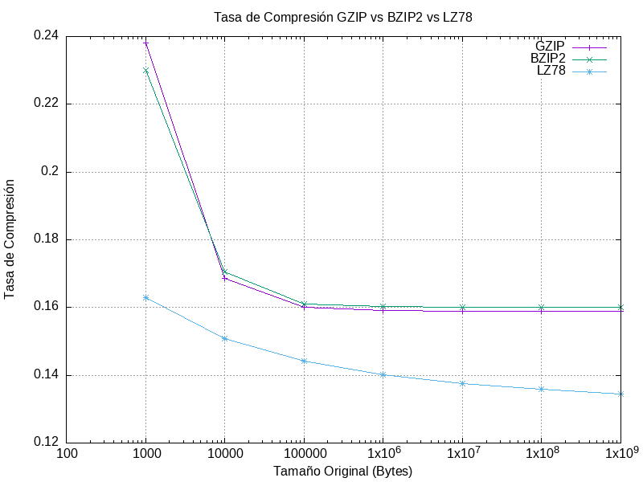
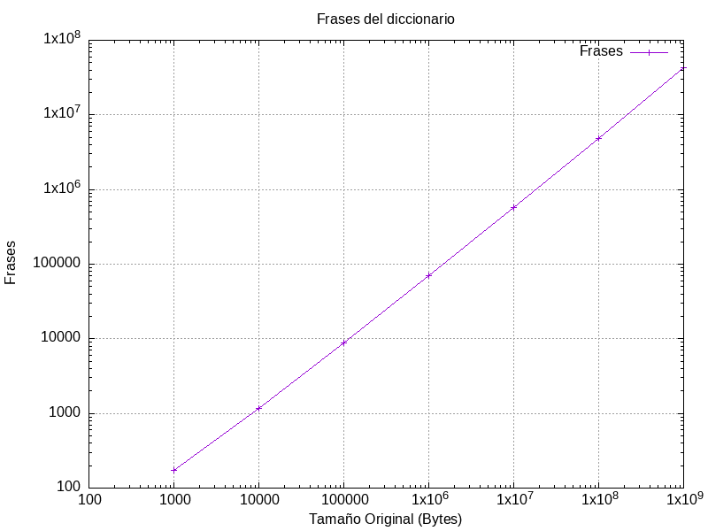

**Flavio Tolosana Hernando (845689)**
**Hoja Compresión - Ejercicio 4**

La implementación del algoritmo LZ78 se encuentra en la carpeta `src` (el main se encuentra en el archivo [LZ78.cpp](src/LZ78.cpp)).

Para crear el ejecutable utilizando el [Makefile](makefile), hay que ejecutar la siguiente instrucción:

``` sh
make
```

#### LZ78 (comprimir)
**Requisitos uso:** \<ficheroEntrada\> solo pude contener los dos siguientes caracteres: 0, 1.
Es así que el el alfabeto es:

$$a \in \{0,1\}$$

Uso:
``` sh
./bin/LZ78 -c <ficheroEntrada> <ficheroSalida>
```

> Al ejecutarlo saldrá por salida estándar lo siguiente: \<numFrases\> \<residuo\>
> - \<numFrases\>: es el número de frases utilizadas en la compresión LZ78 
> - \<residuo\>: 
>   - 1: la última frase es una frase anterior
>   - 0: la última frase es la unión de una frase anterior y un carácter

#### LZ78 (descomprimir)
**Requisitos uso:** hay que pasar por la entrada estándar: \<numFrases\> \<residuo\>

``` sh
./bin/LZ78 -d <ficheroEntrada> <ficheroSalida>
```

Para comprobar su corrección se recomienda ejecutarlo de la siguiente manera.

``` sh
./bin/LZ78 -c <ficheroEntrada> <ficheroSalida> | ./bin/LZ78 -d <ficheroEntrada> <ficheroSalida>
```

En vez de pasar dicha información mediante una tubería, se podría haber añadido un byte más al archivo comprimido. Por ejemplo de la siguiente manera:

$$byte[7] = residuo$$

$$byte[6 \dots 0] = numero\ frases$$

No supone un gran cambio en el tamaño del fichero, pero por simplicidad se ha implementado pasando dicha información por la entrada estándar.

## Análisis

Se han comprimido los siguientes ficheros, los cuales se han generado de forma aleatoria. Cada fichero contiene únicamente caracteres del alfabeto $a \in \{0, 1\}$ y tienen un tamaño que corresponde con su nombre.

> - 1_file_1KB.txt
> - 2_file_10KB.txt
> - 3_file_100KB.txt
> - 4_file_1MB.txt
> - 5_file_10MB.txt
> - 6_file_100MB.txt
> - 7_file_1GB.txt

Se han comprimido utilizando los algoritmos: LZ78, GZIP y BZIP2. A continuación se muestra la tasa de compresión de cada uno.



El algoritmo implementado LZ78 tiene mejor tasa de compresión que los algoritmos GZIP y BZIP2.

Además esta es la gráfica de las frases utilizadas para la compresión de los archivos:



Tal y como se ve, el número de frases es lineal respecto el tamaño de los ficheros.

Los ficheros donde se encuentran los datos de las gráficas son [numeroFrases.txt](plots/numeroFrases.txt) y [tasaCompresion.txt](plots/tasaCompresion.txt).

> En el repositorio de GitHub [LZ78](https://github.com/Flavio-Tolosana/LZ78) se encuentra también el código, además de los scripts utilizados para comprimir todos los archivos y generar las gráficas.
